学生成绩管理系统
========

说明：
--------
* __注册密码：2014052421__
* 程序包含中文和特殊字符，在Window下需ASCII编码，不能UTF-8编码。
* 程序对三个文件要求是文本文件，且`studata.txt`中包含中文字符，在window下也需要ASCII编码

* `studata.txt`：学生数据文件，保存学生姓名学号成绩等信息
* `admintea.txt`：教师登录文件，保存教师账号和密码
* `adminstu.txt`：学生登录文件，保存学生账号和密码

功能展示与介绍
--------

### 概述：
综合运用C语言基础知识，利用预处理、数据类型、自定义函数、结构体、链表、文件操作、WindowsAPI等，初步实现了教师与学生两种操作模式下成绩的录入、修改、删除、查询、排序、保存，以及切换登陆模式、退出等功能，并且在修改、删除、查询、排序功能中可按照多种方式操作。如可根据姓名或名字对成绩进行修改、删除，查询可分为个人成绩查询，分数段查询与不及格成绩查询，排序功能实现按照学号、姓名、五门成绩、总分、绩点，可由大到小或由小到大进行排序。同时，本学生成绩管理系统使用WindowAAPI实现鼠标操作，告别繁琐笨重的键盘，以整齐的区域化布局提供用户友好的操作界面，既解决了由于键盘输入不合法造成的错误，又符合用户的使用习惯。

### 登录界面：

图为运行程序后的初始登录界面。可以选择教师或学生登录，教师权限较大，可进行所有操作。学生只提供查询功能。在登录之间必须注册账号，只有拥有[注册密码](#学生成绩管理系统)的教师或同学才能注册账号。
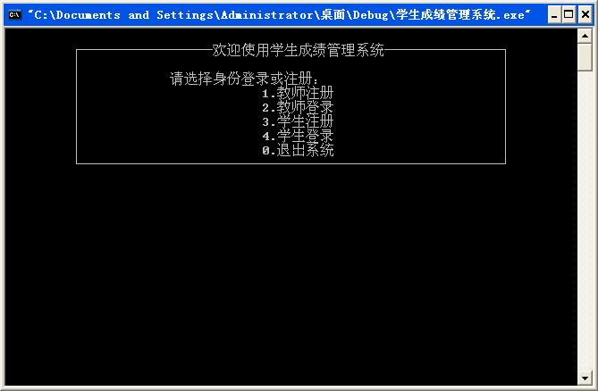

### 注册与登录：

图进行教师注册，__规定密码长度小于等于15__，程序内没有进行密码长度校验。若两次密码不一致，账号(工号)已经被注册或注册密码错误，则提示相关信息；登录成功，按任意键进入操作菜单
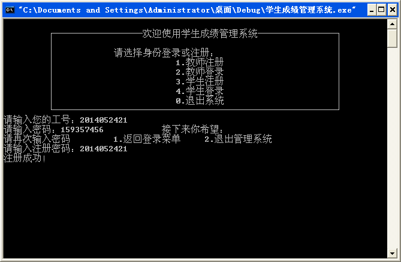

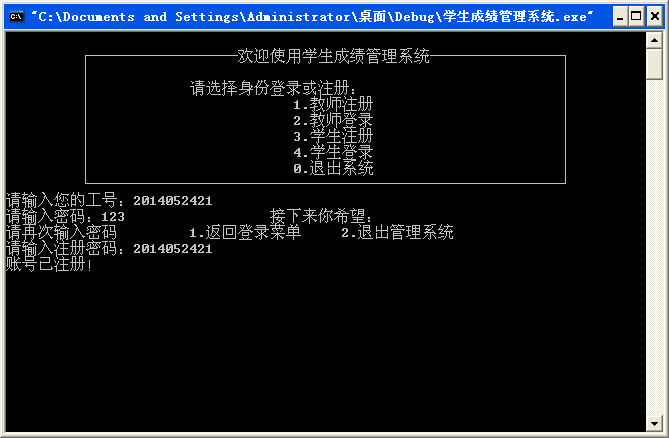

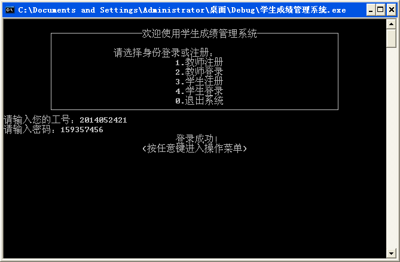

### 主界面：

在主操作菜单中，包含__`录入成绩`__、__`修改成绩`__、__`删除成绩`__、__`查询成绩`__、__`成绩排序`__、__`显示成绩`__、__`保存成绩`__七大功能，以及__`退出登录`__与__`退出系统`__两个其他操作。接下来将一一介绍。
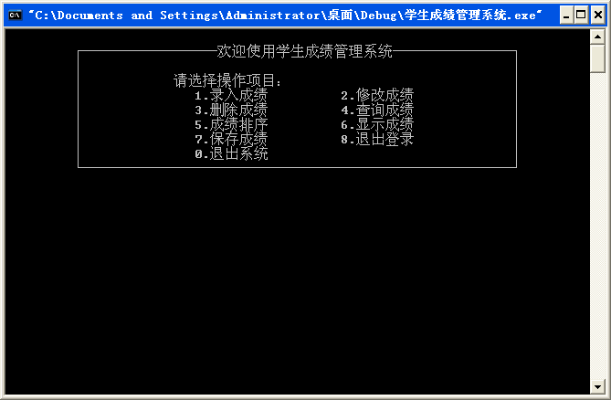

### 录入成绩：

不限定输入人数，以学号为0判定是否输入结束。根据提示依次输入学生信息，输入结束后按任意键返回菜单。此功能暂不提供姓名与学号重复和长度校验，分数学分的区间校验，以及编号长度校验是程序的一大BUG,有待日后完善
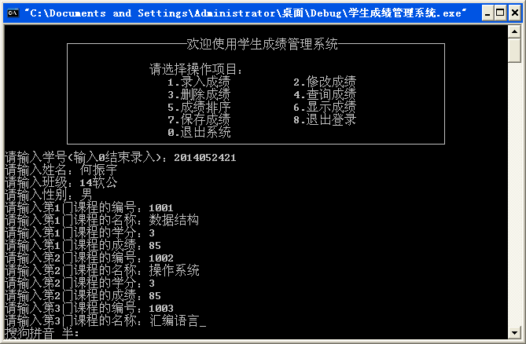

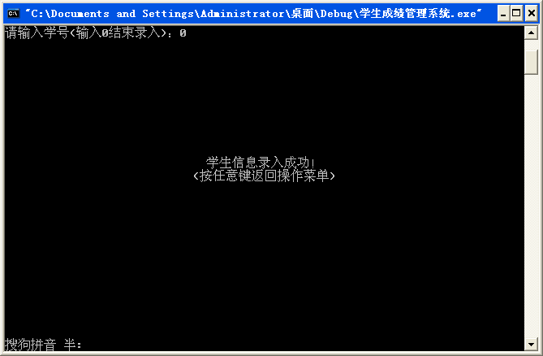

### 修改成绩：

可选择根据学号或姓名修改学生信息，若查无此人，则提示错误并结束修改操作，否则可根据提示修改全部信息(是的，如果不想修改某处信息，则填上之前的数据)
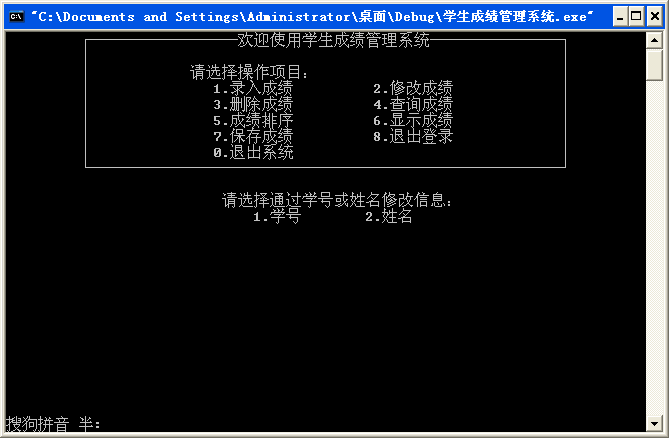

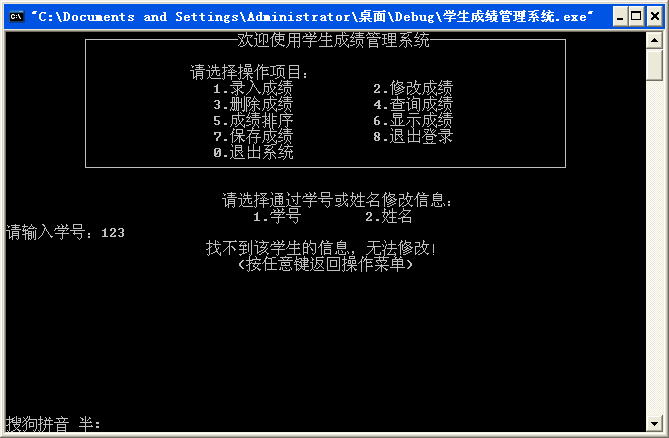

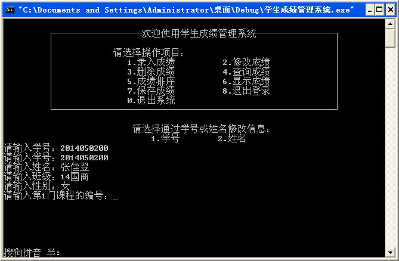

### 删除成绩：

删除成绩与修改成绩类似，可选择根据学号或姓名删除学生，若查无此人，则提示错误并结束操作，否则删除该学生__(如果有确认删除的提示会更好)__
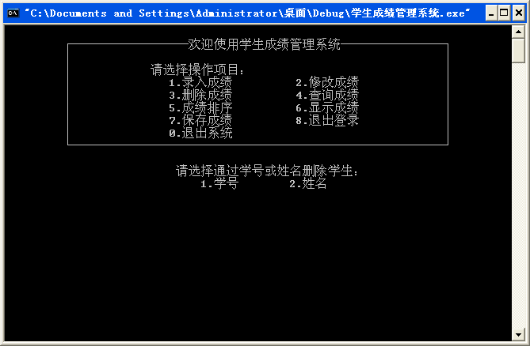

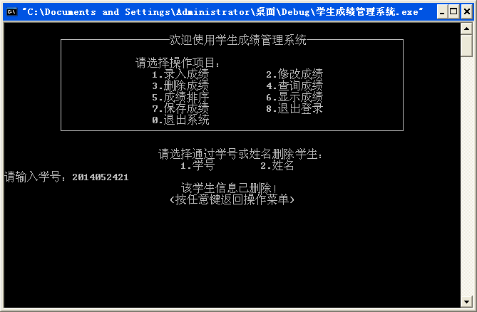

### 查询成绩：

上图为查询成绩界面，有三种查询方式可供选择：个人成绩，分数段成绩和不及格成绩。
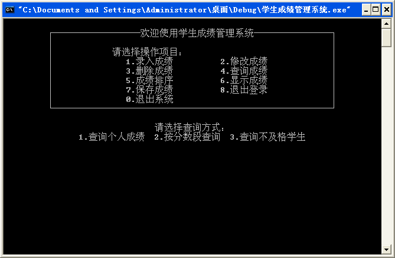

### 个人成绩查询：

个人成绩可根据学号或姓名查询，查有此人则返回该同学详细信息，否则提示没有该学生。
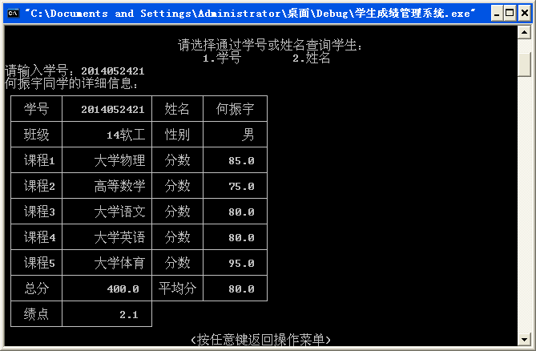

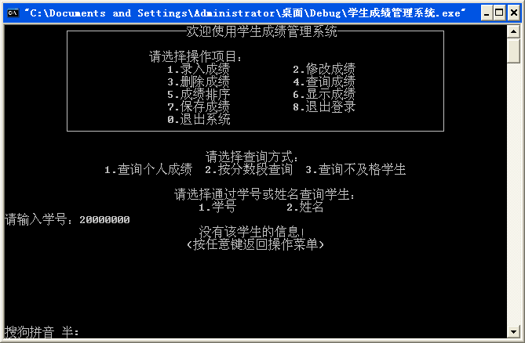

### 分数段查询：

分数段查询要求输入分数下限和分数上线，则系统会返回所有人在这个分数区间(闭区间)内的所有科目成绩。
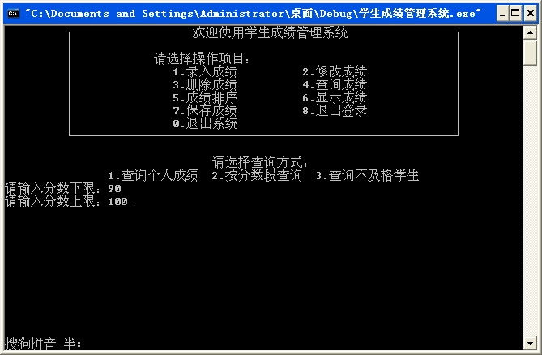

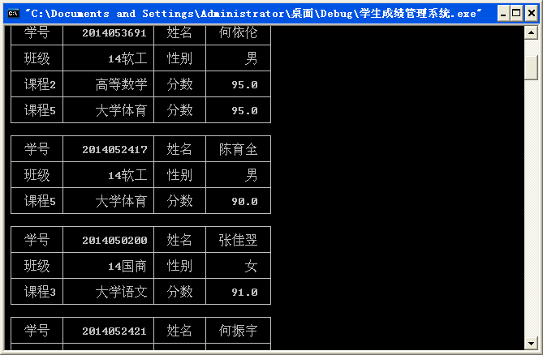

### 不及格成绩查询

返回所有人所有不及格的科目
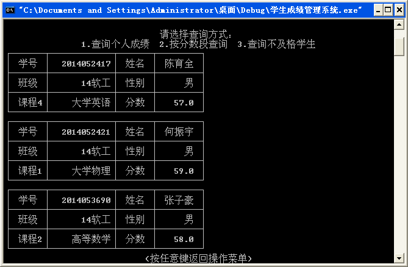

### 成绩排序

支持多种关键字排序，根据提示选择关键字与排序顺序即可完成操作，排序结束后会询问时候显示所有人成绩，若是则调用第六个功能显示成绩，否则返回主菜单。__排序完的成绩并没有立即保存回文件__
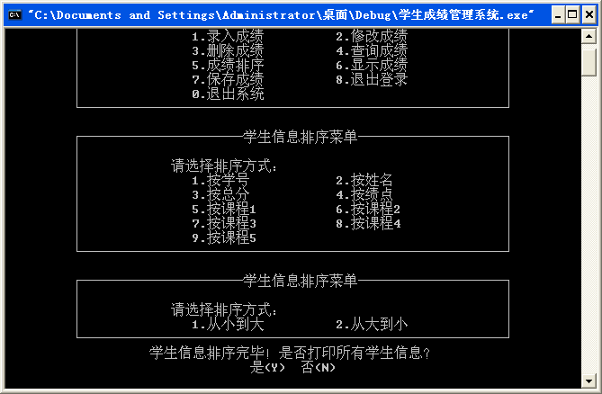

### 显示成绩

可选择显示所有同学成绩或按班级显示成绩。若无学生，则提示无学生记录，否则格式化打印学生成绩并统计人数显示在左下角
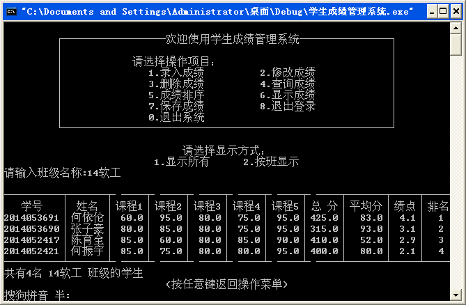

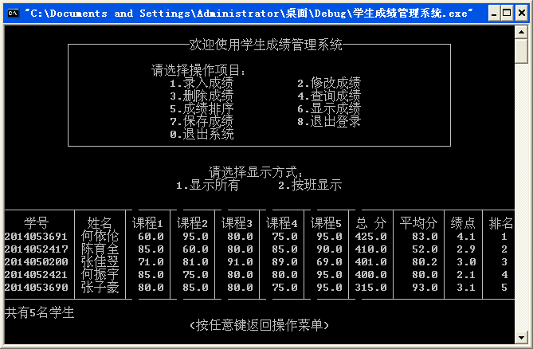

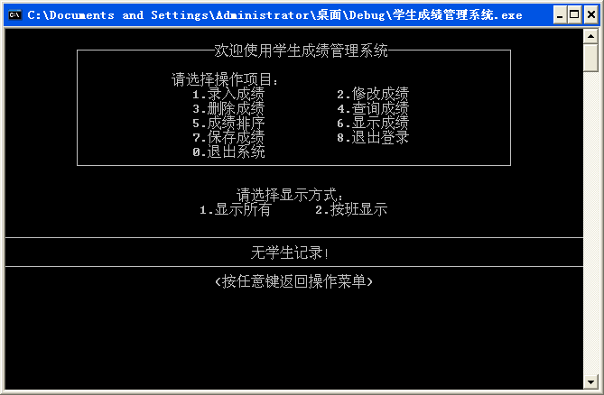

### 保存成绩

手动保存成绩，将学生成绩保存到外存文件`studata.txt`中
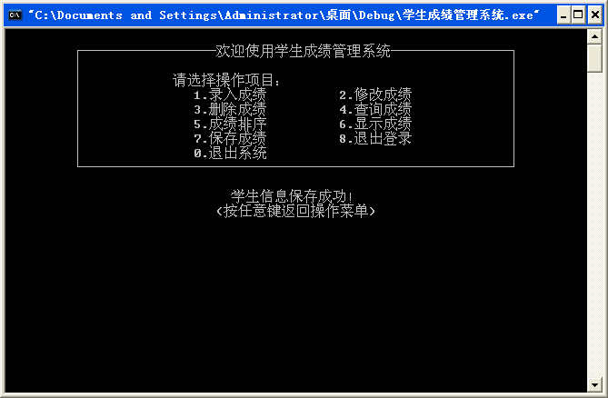

### 退出登录

若成绩未修改或已保存修改，则正常返回登录界面，否则询问用户是否要保存修改。
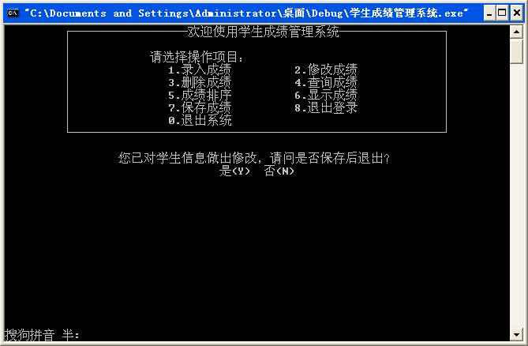

### 学生操作界面

若选择学生登录，则只有[查询成绩](#查询成绩)的功能。
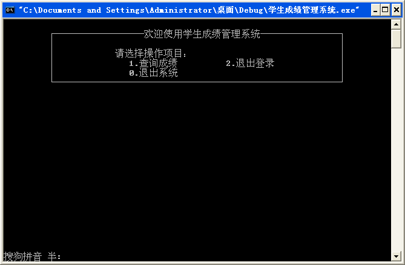

代码细节与实现
--------

### 学生结构体：
```c
typedef struct stu{
	int num;									//学号
	char name[11],sex[5],cla[20];				//姓名，性别，班级
    struct cou les[5];                       	//5门课程
    double all,average,mark;                    //总分，平均分，绩点
	struct stu *next;
}STU;
```

### 课程结构体：
```c
typedef struct cou{
	int lesnumber;								//课程编号
    char lesname[41];      						//课程名字
    double score,point;     					//分数,学分
}COU;
```

### 宏定义：
```c
#define NAME 0
#define NUMBER 1
#define ALL 2
#define MARK 3
#define COU1 4
#define COU2 5
#define COU3 6
#define COU4 7
#define COU5 8
#define FROMBIG 0                  //从大到小
#define FROMSMALL 1      	       //从小到大
```

本程序使用动态链表(无虚头结点)作为学生记录的数据结构，通过对链表的增删改等操作实现对学生记录的管理。每个记录包含学生姓名、学号、性别、班级、五门课程、总分、平均分、绩点等记录项__(其中学号是int类型而不是char[]类型)__。本程序包含windowAPI库，支持鼠标操作是程序一大亮点。

### 函数说明：
```c
int RegisterTea();      						 //教师注册
int RegisterStu();      						 //学生注册
```
根据提示要求用户输入账号(学号)和密码，匹配成功返回1，匹配失败返回0。使用`scanf`输入，不能输入空格等分隔符，没有密码长度的校验，密码是明文，但有控制账号不能重复

```c
int Count(STU *head);
```
遍历链表，计算链表节点个数，即学生人数，可用于判断是否有学生记录或学生人数是否增加

```c
int StuNum(STU *p,double low,double high);
```
计算某学生分数在[low,high]之间的科目数量，用于分数段查询和不及格查询

```c
void DisplayAll(STU *head);						 //打印所有学生信息
```
遍历链表，若链表为空，则打印“无学生记录”，否则打印所有学生的学号、姓名和五门课程的成绩、总分、平均分和排名__(其实不是排名只是序号而已)__

```c
STU *Search_name(STU *head,char *name);		     //通过名字搜索学生
STU *Search_num(STU *head,int num);		   		 //通过学号搜索学生
```
顺序遍历链表，若搜索到匹配的学生返回该节点的指针，否则返回NULL

```c
void DisplayOne(STU *head,int n,char *name);     //打印一个学生详细信息
```
形参head为链表头指针，n可选择`NAME`或`NUM`作为关键字的类型，name作为学生搜索的关键字。如打印名字为"ABC"的同学的信息，则`DisplayOne(head,NAME,"ABC")`若查找不到该同学，则打印"没有该同学的信息"，否则打印该同学学号、姓名等所有信息

```c
void DisplayCla(STU *head,char *class);			 //按班级显示学生信息
```
遍历链表，查找是否有班级为class的学生，若无则打印“无班级为class的学生”，否则打印班级为class的所有学生

```c
void DisplayGrade(STU *head,double low,double high);			//按分数段查询成绩
void DisplayFail(STU *head);					 //不及格科目查询
```
不及格成绩是分数段成绩的特殊情况，其实只要调用`DisplayGrade(head,0,59)`就好了。若无该分数段的学生则打印"没有学生"，否则以详细信息的形式打印所有学生分数在该区间的所有科目

```c
STU *Delete(STU *head,int n,char *name,int *item);	//删除学生成绩
```
形参中n是关键字类型，可选择`NAME`或`NUM`,name是用于搜索的关键字，item接收一个整型信号，若item为0，则表示没有找到该学生，删除失败；若item为1，则表示已成功删除该学生。返回类型为学生节点STU，表示新的链表头指针(若删除的是链表的第一个节点，则需要更新头指针)

```c
int Modify(STU *head,int n,char *name);			//修改学生信息
```
形参中n是关键字类型，可选择`NAME`或`NUM`,name是用于搜索的关键字，调用`Search_name`或`Search_num`查找该学生，若该学生不存在则修改失败，返回0，否则依次修改学生的所有信息__(必须修改所有信息，本程序不合理的地方之一)__，返回1表示修改成功

```c
int Save(STU *head);					//保存成绩
```
将链表里的所有学生节点格式化输出到__文本文件__`studata.txt`中保存

```c
int Lof(FILE *fp);					//计算文件中学生人数
```
计算文件中不为`""`且不为`"\n"`的行的行数，方便读取文件时知道文件有多少非空行，即有多少个学生记录。__计算完后将文件指针返回文件头__

```c
STU *Initialize();					//初始化读取文件中的学生
```
打开并读取`studata.txt`文件的数据，新建一个链表，将数据填充进链表中，对链表按总分由大到小的顺序排序，至此初始化操作完成，关闭文件并返回链表的头指针。若该文件第一行是空行，则认为该文件是空的(其实有可能第一行是空行，第二行开始才有内容，这里有一个BUG)，顺序读取每一行的内容存到链表中，若中间存在空行则读取会出现问题。文件末尾允许存在空行，但存在空格等也会导致读取出错，有待改进

```c
int Position(STU *head,STU *p);
STU *SetPosition(STU *head,int n);
```
前者返回节点p在链表head中的位置，若不存在则返回-1；后者返回链表head中第n个位置的节点指针，若n超过链表的长度，则返回NULL。用于链表的排序

```c
STU *Sort(STU *head,int m,int n);			//成绩排序
```
采用直接插入法进行排序，改变节点的指针起到排序的作用。相对其他排序法直接插入法每趟排序只需要移动一个节点，需要改变的指针数量也相对较少。但这里直接插入法用得不是很好，还是用数组的思想，因此使用了`SetPosition`和`Position`进行定位，帮助排序。__链表排序可以考虑将每个节点的地址存在一个数组里，对数组进行排序，排序完再调整链表顺序，需要长度为4n的辅助空间。或者采用简单选择排序，挑选出最小的节点单独链成一个链表，将它从原链表分离，再寻找第二个节点，链到新链表中，从原链表分离，以此类推。也可以用直接插入排序，将链表逻辑上分成已排序和待排序两个链表，每次从待排序链表中取下一个，插入已排序链表中，以此类推。__

```c
STU *Creat(int n);
```
创建一个长度为n的链表，返回链表的头指针

```c
STU *Connect(STU *head,STU *end)                	//连接两个链表
```
将链表head的尾与end的头相连，这里缺少判断形参合法性

```c
double Mark(STU *p);
```
计算绩点，根据成绩转化为单科绩点，同时累加每科的学分和单科绩点，最后除以总绩点除以总学分就是平均绩点

```c
STU *Input();              			 	//输入学生成绩
```
创建一个节点并让用户输入相关数据，将数据填充进节点内。完成一个学生记录的输入，返回节点的指针。__注意并没有将该记录连接到链表中，代码中没有对各个数据项进行校验，判断其是否合法，存在BUG__

```c
void HideCursor();					//隐藏光标
void PutCursor();					//显示光标
void GotoXy(int x,int y);				//将光标移动到(X,Y)
void Clear(int x,int y,int line);			//清除line行的内容后将坐标返回(x,y)
void GetXy(int *X,int *Y,int x1,int x2,int y1,int y2);	//获取在规定范围内鼠标点击的坐标
```
鼠标操作相关函数，本程序虽然能用鼠标操作，但美中不足的是只能用鼠标操作，如果能用键盘会更好

```c
int main();
```
又臭又长，比自定义函数还看不下去，有待改进。

## [回到顶部](#学生成绩管理系统)
